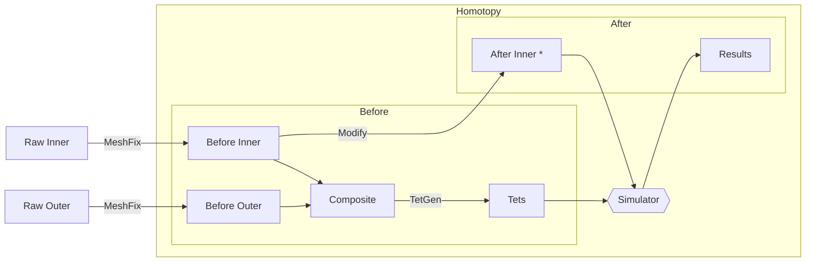

## Project Target

- **Data Collection:** pre- & post- surgery CT of individuals
- **Target**
  - **Input:** pre-surgery CT + surgical details (post-surgery skeleton)
  - **Output:** post-surgery face

## TODO List

- [ ] preprocessing
  - [ ] CT -> mesh
    - [x] CT -> point cloud
    - [x] point cloud -> mesh
    - [ ] test cases
      - [x] face before surgery
      - [ ] skull before surgery
      - [ ] face after surgery
      - [ ] skull after surgery
  - [x] MeshFix
  - [x] TetGen
  - [x] composite
- [x] simulation
- [ ] postprocessing
  - [ ] split

## Pipeline

## Components

- [x] `ct_to_point_cloud.py` - convert CT to point cloud
- [x] `landmarks_viewer.py` - view landmarks
- [x] `mesh_fix.py` - remove "defects"
- [x] `composite.py` - composite inner and outer meshes
- [x] `tetgen` - tetrahedralize mesh
- [x] `simulate.py` - simulate
- [x] `split.py` - split mesh

## Next Week
