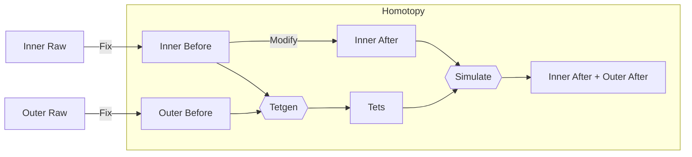

```mermaid
flowchart LR
  subgraph Homotopy
    IB
    OB
    T
    IA
    Tets
    S
    R
  end
  IR[Inner Raw] -- Fix --> IB[Inner Before]
  OR[Outer Raw] -- Fix --> OB[Outer Before]
  IB -- Modify --> IA[Inner After]
  IA --> S{{Simulate}}
  Tets --> S
  IB --> T{{Tetgen}}
  OB --> T
  T --> Tets
  S --> R[Inner After + Outer After]
```
